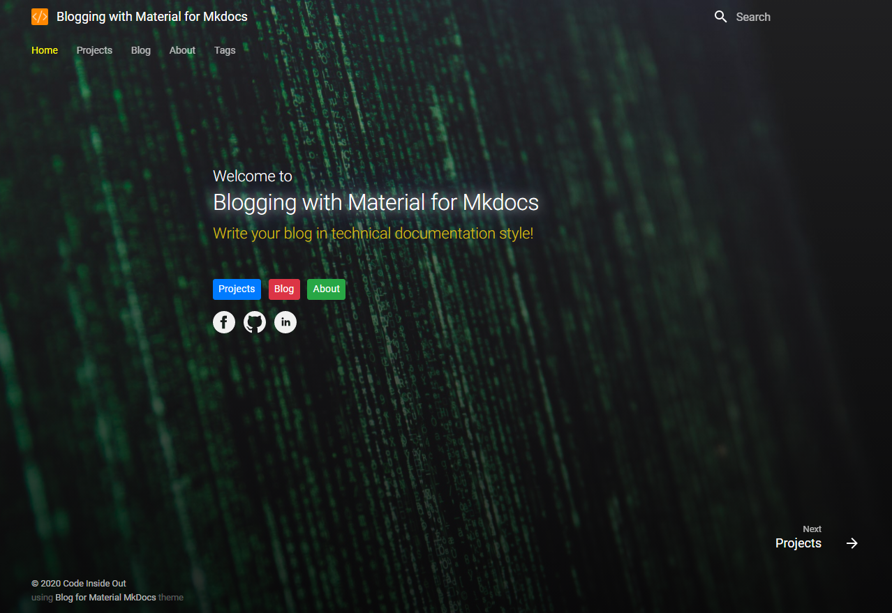
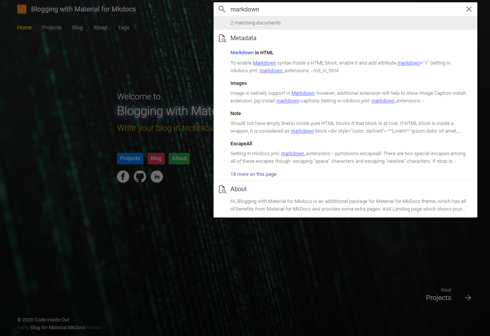
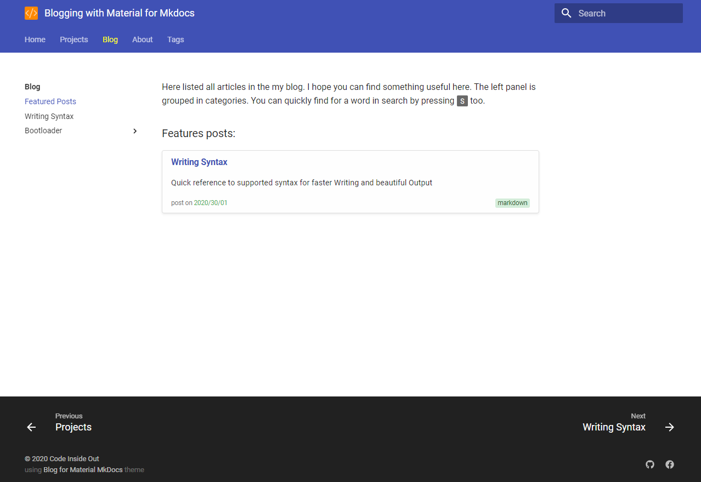
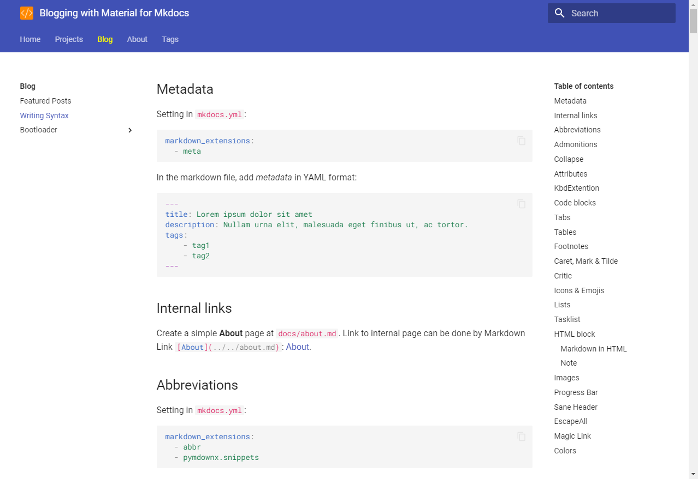

Blogging with Material for MkDocs
=================================
Write your blog in techincal documentation style.

# Features
- Backed with [Material for MkDocs](https://squidfunk.github.io/mkdocs-material/) for quickly create your static site from a set of Markdown files:
  - customizable
  - searchable
  - mobile-friendly
  - 40+ languages
  - setup in 5 minutes

- Add **Landing page** which shows your homepage
- Add **Blog page** which has featured posts
- Add **Tags pages** for quickly find related posts
- Enable many **useful extensions** for Markdown, help you to write content quickly with additional elements like callouts, tabs, syntax highlight, code copy.

# Quick start

`Blogging with Material for MkDocs` can be installed from `git` at this moment.

1. Checkout this repository
   
2. Install virtual environment and activate it, if you need
   
   `python -m venv .venv`

   `.venv\Scripts\activate.bat`

3. Install requirements
   
   `pip install -r requirements.txt`

4. Write your posts in the folder `/docs`
   
5. Preview your site at <localhost:8000> with `mkdocs`
   
   `mkdocs serve`

6. Generate your site
   
   `mkdocs build`

7. Publish your site by copying the folder `/site` to your root of website folder

# Preview

# License

[**MIT License**](LICENSE)

Copyright (c) 2016-2020 Vu Quang Trong