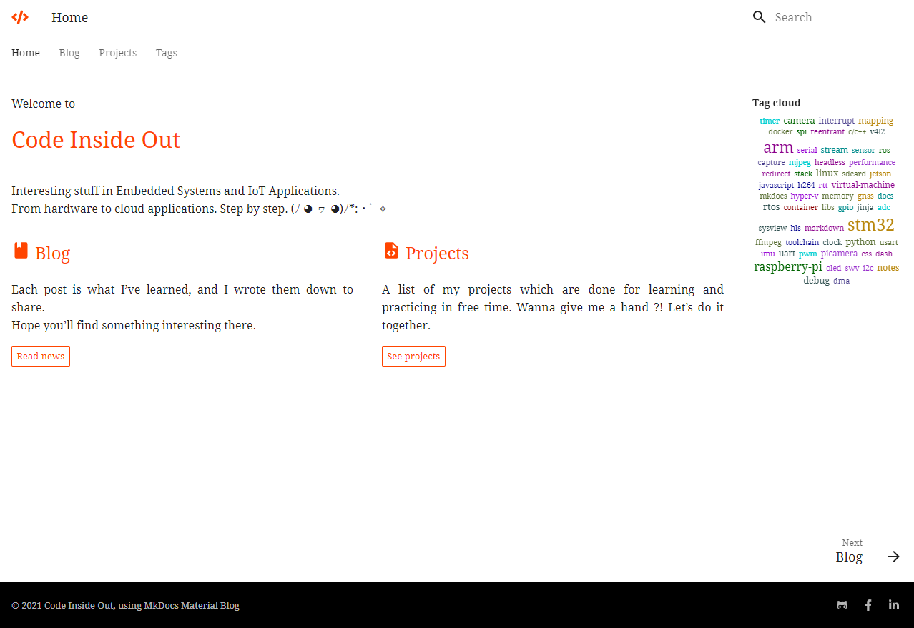
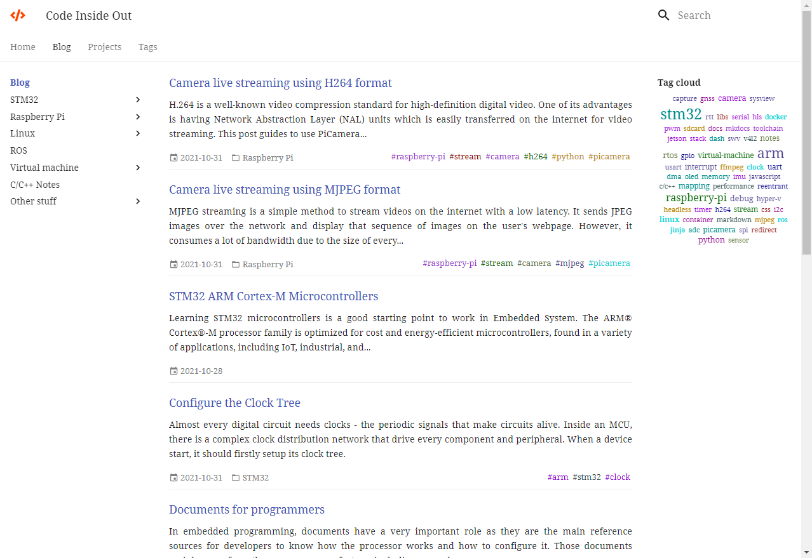
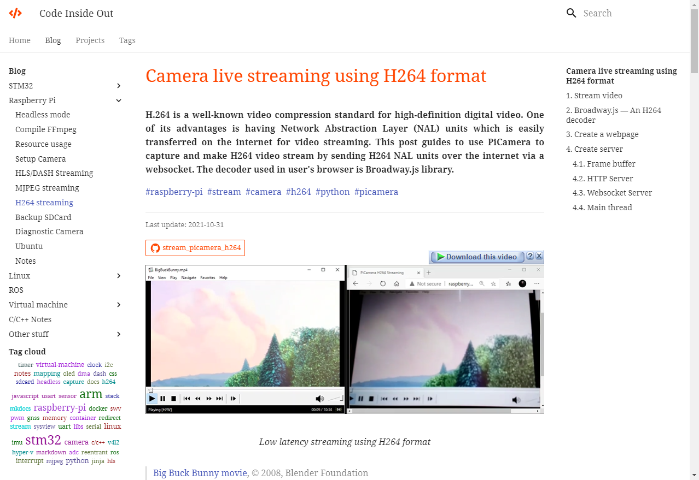
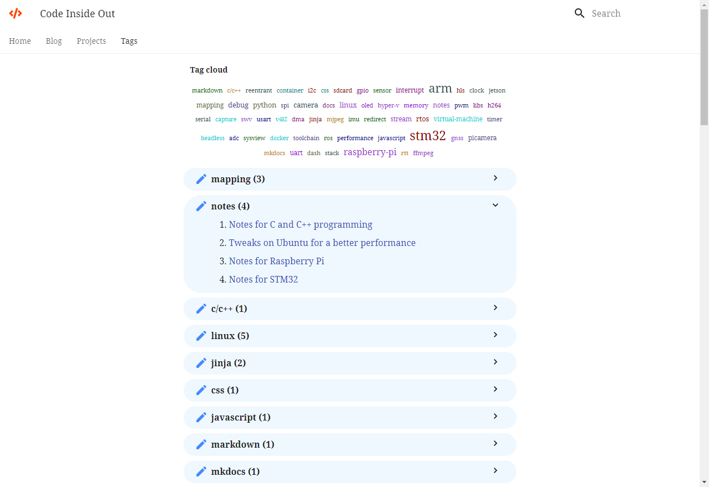

# 1. MkDocs Material Blog theme

Based on a popular theme [Material for MkDocs](https://squidfunk.github.io/mkdocs-material/) for [MkDocs](https://www.mkdocs.org/) static site generator, I added new layouts and customized some styles to show this site in a blog-like theme.

Please visit my blog at [vuquangtrong.github.io](https://vuquangtrong.github.io) to see this theme in live.

# 2. Prepare

1. Clone this repo
2. Run `_new.bat` to init a virtual environment
3. Run `_venv.bat` to activate the virtual environment

__Note that you are using _virtual environment_, next time when you start to edit this project, make sure to run _venv.bat_ first.__

# 3. Installation

Run `_install.bat` to install required packages.

# 4. Configuration

Edit `mkdocs.yaml` to as your need!

# 5. Write docs

You can add your new documents in `docs\blog`.

Refer to [Markdown syntax](https://www.codeinsideout.com/blog/other-stuff/markdown-syntax/) for writing documents.

# 6. Preview

1. Run `_run.bat`
2. Preview in browser at [http://127.0.0.1:8000/](http://127.0.0.1:8000/)

# 7. Publish

Run `mkdocs build`, then copy the content in the `site` folder to your website's serving folder.

# 8. Print to PDF

This function only work when you have Chrome and ChromeDrive installed and configured. For more detail, please visit [Print to PDF plugin](https://www.codeinsideout.com/blog/setup-blog/print-to-pdf/#4-print-to-pdf-plugin).

# 9. Preview

# 10. License

**MIT License**
Copyright (c) 2020-2021 Vu Quang Trong
