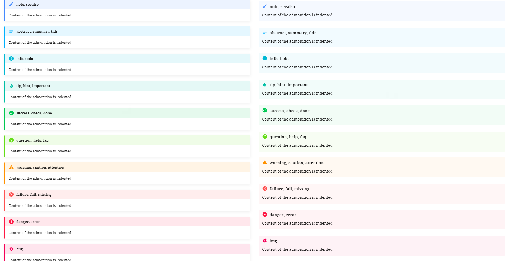

## 1. The post's title

By using the [Awesome Pages](../mkdocs-plugins/index.md#1-awesome-pages) plugin and the [ Section index](../mkdocs-plugins/index.md#2-section-index) plugin, the navigation sidebar can show a good structure of posts. However, each entry is displaying the post's title with long text, this make the navigation bar look a bit messy.

It is easy to add a full title into a post by using the [Metadata section](../markdown-syntax/index.md#1-meta-data). For example:

```yaml
---
title: Customize theme
title_full: Customize the theme with personal styles
description: A personal website should look different to others ...
---
```

However, the content of each post will also display the short title. To fix this, I am going to override the main template. Before do it, I will add tags in the Metadata section also.

## 2. The post's tags

A tag is a word or a phrase that describes one main point of a blog post's content. They are an easy way to attach labels to the content and link similar posts together.

The tags of a post are defined in the [Metadata section](../markdown-syntax/index.md#1-meta-data), then they are gathered and processed in templates later.

```yaml
---
title: title
description: description
tags:
    - python
    - mkdocs
---
```

## 3. The Tags page

The tag page is the place to list all tags, and list all pages that have a common tag. A new page will be created at `docs\tags\index.md`. There is a method to use [MkDocs Macros](../mkdocs-plugins/index.md#5-macros) in Markdown template, but it is quite complicated.

I use Jinja syntax to create the content of the Tags page, therefore, create a new file at `overrides\tags.html` and use it as the template for the Tags page:

::: file
docs\\tags\\index.md

```yaml
---8<--- "docs\tags\index.md"
```

The `tags.html` template to include 2 parts:

-   `tag-cloud.html`: make a tag cloud to see how many pages are associated with a tag
-   `tag-list-pages.html`: for each tag, list all pages having that tag to show similar articles together

::: file
overrides\\tags.html

```jinja
---8<--- "overrides\tags.html"
```

Tags will have random colors, to easily disguise them to each other. A helper `random_color()` macro that returns a random color looks like:

::: file
overrides\\partials\\random-colors.html

```jinja
---8<--- "overrides\partials\random-colors.html"
```

Then it can be imported as:

```jinja

```

### 3.1. The tag cloud

The tag cloud shows all tags in different size and color. The bigger a tag is, the more pages mention that tag. Steps to make a tag cloud:

1. Scan all pages and create a list of pairs `(tag, pages[])`

    ```jinja
    
    {# scan all pages #}
    
    
      {# extract tags if available #}
      
      
        
        {# read more about scope at
        https://jinja.palletsprojects.com/en/2.11.x/templates/#assignments
        #}
        {# check if tag exists, append to its page list #}
        
        
        
          
          {{ ps.append(p.page) or "" }} {# use (or "") to not print} #}
        
        
        {# if tag doesn't exist, create new page list#}
        
        {{ tags.append((tag, [p.page])) or "" }}
        
      
        {{ tags.append((tag, [p.page])) or "" }}
      
      
    
    
    ```

2. Count the number of pages for each tag then show each tag with different text size and color using `font-size` and `color` attributes

    ```jinja
    <p class="md-nav">
        <label class="md-nav__title">Tag cloud</label>
    </p>
    <div class="tag-cloud-content">
    
        
        
        {# create a link with tag name #}
        {# font size is based on the page count #}
        <a class="tag" href="{{ config.site_url }}tags/#{{ tag }}">
            <span class="tag-name" style="
            font-size:{{ 0.6+ps|count*0.1}}rem;
            color:{{ random_color() }};
            ">
            {{- tag -}}
            </span>
            <sup class="tag-count">{{- ps|count -}}</sup>
        </a>
        
    
        <div>
        <h3>No tag found!</h3>
        </div>
    
    </div>
    ```

### 3.2. List pages of a tag

This section is simple as it just needs to loop through the list of pairs `(tag, pages[])` and create a link to each page. Steps to do that:

1. Scan all pages and create a list of pairs `(tag, pages[])`

    > see above section

2. Show each tag with the list of pages in a collapsible `<details>` block

    ```jinja
    <div class="tag-page-list">
    
        
        <details class="note" id={{ tag }}>
        <summary>
            {{- tag }} ({{- ps|count -}})
            <a class="headerlink" href="#{{ tag }}">⚓︎</a>
        </summary>
        <ol>
            
            <li>
            <a href="{{ page.canonical_url }}">
                
                {{- p.meta.title_full -}}
                
                {{- p.meta.title -}}
                
                {{- p.title -}}`
                
            </a>
            </li>
            
        </ol>
        </details>
    
    </div>
    ```

3. Only one tag block is open at a time to easily follow the selected tag. To do this, I added a callback of the `toggle` event on all tag blocks. Whenever a block is opened, this script will close all others

    ```js
    [...document.getElementsByTagName("details")].forEach((D, _, A) => {
        D.open = false;
        D.addEventListener(
            "toggle",
            (E) => D.open && A.forEach((d) => d != E.target && (d.open = false))
        );
    });
    ```

4. A tag block can be opened via URL with hash being the selected tag

    ```js
    var hash = window.location.hash.substr(1);
    if (hash) {
        document.getElementById(hash).open = true;
    }
    ```

Visit the [Tags](../../../tags/index.md) to see the result.

## 4. The recent blog posts

There should be a page showing the recent posts to help users see what is new and updated. With the [Revision Date](../mkdocs-plugins/index.md#3-revision-date) plugin, it is able to use two new meta-dat fields: `git_revision_date_localized`, and `git_creation_date_localized` if the option `enable_creation_date` is `true`.

Create new `index.md` file inside the `blog` folder. When using the [Section Index](../mkdocs-plugins/index.md#2-section-index) plugin, this index file will be merged to the Blog section, therefore, when user select the Blog label, there is a list of recent posts will be shown.

This page will use the `blog.html` template in which it scans all posts and check the creation date to make a list of posts. Each post should be displayed in a container and be formatted to show the title, the description (at most 250 character using the `truncate` filter), the creation date, and its tags.

!!! caution nt "\ "

    Need to check the page's path to filter blog posts. In my code, I use the `abs_url` and its length to check if a page is in the `blog` directory.

Here is the code to sort all pages in order of creation date, and then filter all blog posts to save into the array `blog_pages` which will be used to generate content.

```jinja


    
    
        {{ blog_pages.append(pg) or "" }}
    

<div class="pages">
    ... create list from blog_pages ...
</div>
```

### 4.1. Create the pagination

When the number of posts goes bigger, the recent post list becomes longer. It's time to brake the long list into pages - the user can click on the page number to see its children posts.

This is called "Pagination". How to implement it?

Jinja template has the [`slice` filter](https://jinja.palletsprojects.com/en/3.0.x/templates/#jinja-filters.slice) to divide a list into sub-lists. Here, I'd like to have maximum of 10 posts on each page.

```jinja


    

<div class="pages">
    
    <div class="page" id="page{{ loop.index }}">
        
            <div class="post">
                ... create post layout and content ...
            </div>
        
    </div>

</div>
```

### 4.2. Create a post entry

Each post is wrapped inside a `#!html <div class="post">` and its elements are marked with different classes, such as `post-title`, `post-description`, etc. for applying styles later.

```jinja
<div class="post">
    <h3 class="post-title">
        <a class="link" href="{{ pg.canonical_url }}">{{ title }}</a>
    </h3>
    <p class="post-description">
        
        {{ pg.meta.description | truncate }}
        
    </p>
    <div class="post-extra">
        <span class="post-timestamp">
            
            <span class="post-timestamp-update">
                Updated: {{ pg.meta.git_revision_date_localized -}}
            </span>
            
        </span>
        <span class="post-tags">
            
            
            <a class="tag" href="{{ config.site_url }}tags/#{{tag}}">
                <span class="tag-name"
                        style="color:{{random_color()}};">
                    #{{ tag }}
                </span>
            </a>
            
            
        </span>
    </div>
    <hr />
</div>
```

Here is a simple styles to make each post display necessary basic information:

```css
.md-typeset .post:first-of-type h3 {
    margin-top: 0;
}
.md-typeset .post-title {
    margin-bottom: 0;
}
.md-typeset .post-extra {
    color: gray;
}
.md-typeset .post-tags {
    float: right;
}
```

### 4.3. Create active page

To show the current active page, I use pure css and javascript. The idea is to use the URL hash to detect which page is activated, such as `#page1`.

```jinja
<div class="center">
    <div class="pagination" id="pagination">
    <a href="#">&laquo;</a>
    
        <a class="page-number active"
            href="#page{{ loop.index }}">{{ loop.index }}</a>
    
    <a href="#">&raquo;</a>
    </div>
</div>
```

Then add some styles to the pagination block and its children links:

\
**CSS Styles**:

Use `target` keyword to select the selected _page id_, then show only the target element.

::: file
assets\\extra.css

```css
.md-typeset .pages > .page:target ~ .page:last-child,
.md-typeset .pages > .page {
    display: none;
}
.md-typeset .pages > :last-child,
.md-typeset .pages > .page:target {
    display: block;
}
```

\
**Javascript**

When the page is loaded, a script will run to get all pagination's links, and then add a callback function for click event, that remove `active` class from last activated element and then assign `active` class to the event's source element. Note that the first page is activated by default when the page is loaded.

::: file
assets\\extra.js

```js
var pagination = document.getElementById("pagination");
var links = pagination.getElementsByClassName("page-number");
if (links.length) {
    for (var i = 0; i < links.length; i++) {
        links[i].addEventListener("click", function () {
            var current = pagination.getElementsByClassName("active");
            console.log(current);
            if (current.length) {
                current[0].className = current[0].className.replace(
                    " active",
                    ""
                );
            }
            this.className += " active";
        });
    }
    links[0].click();
}
```

<!--
::: file
overrides\\blog.html

```jinja
---8<--- "overrides\blog.html"
```
-->

## 5. The main template

The `main.html` file, extending the `base.html` template, will be used for all markdown pages and it is the starting point to add custom template.

To override it, add the `main.html` file in the `overrides` folder. Here are things I'm going to do to add more content into a blog post:

1. Extract metadata to get `title`, `title_full`, `description`, `tags`, and other information

    ```jinja
    
    
        
    
        
    
        
    

    
    
        
    

    
        
    

    
        
    
    ```

2. Add block to use the [Open Graph protocol](https://ogp.me/) to show the page's information when an user shares a page on a social network

    ```jinja
    
        <title>{{ title | striptags }} - {{ config.site_name }}</title>
    

    
        <meta property="og:type" content="website" />
        <meta property="og:title" content="
            {{- title | striptags ~ ' - ' ~ config.site_name -}}
        "/>
        <meta property="og:description" content="{{ description }}" />
        <meta property="og:url" content="{{ page.canonical_url }}" />
        <meta property="og:image" content="
                
                    {{ page.canonical_url ~ image }}
                
                    {{ config.site_url ~ 'assets/banner.jpg' }}
                
                " />
        <meta property="og:site_name" content="{{ config.site_name }}" />
        <meta name="twitter:card" content="summary" />
    
    ```

3. The page content should have a `cover` section which displays the `title`, `description` and `tags` on all pages, except the home page.

    ```jinja
    
        
        <div class="cover">
            <h1 class="page-title">
                {{ title | d(config.site_name, true) }}
            </h1>
            <p class="page-description">{{ description }}</p>
            
            <p class="page-tags">
                
                <a class="tag" href="{{ config.site_url }}tags/#{{tag}}">
                    <span class="tag-name">
                        #{{ tag }}
                    </span>
                </a>
                
            </p>
            
        </div>
        
        {{ page.content }}
    
    ```

4. The tag cloud should show in the sidebars based on the page's width

    ```jinja
    
        
            
              
            
            <div class="md-sidebar md-sidebar--primary"
                data-md-component="sidebar"
                data-md-type="navigation" {{ hidden }}>
                <div class="md-sidebar__scrollwrap">
                    <div class="md-sidebar__inner">
                        
                        <div class="tag-cloud-nav">
                            
                        </div>
                    </div>
                </div>
            </div>
        
        
            
                
            
            <div class="md-sidebar md-sidebar--secondary"
                data-md-component="sidebar"
                data-md-type="toc" {{ hidden }}>
                <div class="md-sidebar__scrollwrap">
                    <div class="md-sidebar__inner">
                        
                        <div class="tag-cloud-toc">
                            
                        </div>
                    </div>
                </div>
            </div>
        
    
    ```

## 6. Zoom-in Images

As mentioned in the [Images](../markdown-syntax/index.md#7-images) section, [view-bigimg](https://github.com/newming/view-bigimg) library helps to zoom and pan images. It's useful when the image is in high resolution and resized to fit site's width.

Download `view-bigimg.css` and `view-bigimg.js` files from the [view-bigimg](https://github.com/newming/view-bigimg/tree/master/src) repo, then add them into the addition assets configs in `mkdocs.yml`:

::: file
mkdocs.yml

```yaml
extra_css:
    - assets/view-bigimg.css
extra_javascript:
    - assets/view-bigimg.js
```

When click on the image, this library will create a new layer and show the image in a bigger size. However, it must be clicked on the close button to go back to the page's content. I want to simplify this step by just click on the image. Panning still is activated by press and hold. Therefore, I write a function to detect `mousedown` and `mousemove` event, then only close the image if it is a simple click:

::: file
assets\\extra.js

```js
var dragged = false;
document.addEventListener("mousedown", () => (dragged = false));
document.addEventListener("mousemove", () => (dragged = true));

var viewer = new ViewBigimg();
var figures = document.querySelectorAll("img");
for (var i = 0; i < figures.length; i++) {
    figures[i].onclick = (e) => {
        if (e.target.nodeName === "IMG") {
            viewer.show(e.target.src);
        }
    };
}
var containers = document.querySelectorAll("#iv-container .iv-image-view");
for (var i = 0; i < containers.length; i++) {
    containers[i].onclick = () => {
        if (!dragged) {
            viewer.hide();
        }
    };
}
```

## 7. Open external links

When following links, to remain the blog page opened, external links should be shown in new tabs without any tracking information. To do that, I write some lines of code to get all external links in the page, then set `target = "_blank"` and add attribute `rel = "noopener noreferrer"` to them.

::: file
assets\\extra.js

```js
/* open external links in new tab */
var links = document.links;
for (var i = 0, linksLength = links.length; i < linksLength; i++) {
    if (links[i].hostname != window.location.hostname) {
        links[i].target = "_blank";
        links[i].setAttribute("rel", "noopener noreferrer");
        links[i].className += " externalLink";
    } else {
        links[i].className += " localLink";
    }
}
```

## 8. Custom styles

After all extensions and plugins are installed, some extra pages and elements are added, this is the time to tweak the whole site's styles.

### 8.1. Colors

Here are some small additional styles to make the theme look a bit harmonious with the selected theme color

-   Logo and headers should be in orange to be highlighted, and active links can be in dark blue:

    ```css
    .md-logo,
    .md-typeset h1 {
        color: orangered;
    }
    .md-typeset h2,
    .md-typeset h3,
    .md-typeset h4,
    .md-tabs__link.md-tabs__link--active,
    .md-nav__link.md-nav__link--active {
        color: darkblue;
    }
    ```

-   Search input should have white background color:

    ```css
    .md-search__input {
        background-color: white !important;
    }
    ```

-   Non-highlighted code needs stand out a bit in dark red in white background:

    ```css
    .md-typeset code {
        color: darkred;
        background-color: rgba(0, 0, 0, 0.01);
    }
    ```

-   Normal paragraph should be fully justified:

    ```css
    .md-typeset p {
        text-align: justify;
    }
    ```

-   Emphasized text should be in dark magenta:

    ```css
    .md-typeset em {
        color: darkmagenta;
    }
    ```

-   Footer should look smaller by changing the background color:

    ```css
    .md-footer {
        color: unset;
        background-color: unset;
    }
    .md-footer-meta {
        background-color: black;
    }
    ```

-   The highlight color should not be too yellowish, I'd like to reduce its opacity:

    ```css
    :root > * {
        --md-code-hl-color: rgba(255, 255, 0, 0.1);
        --md-typeset-mark-color: var(--md-code-hl-color);
    }
    ```

### 8.2. Admonition

I want to make admonitions look more harmonious to the theme, so I decided to remove border and shadow box, then add a light background color which is the title background color of each type. The font and the margin also need modified a bit to make admonitions look consistent to the main content.

First, icon should be bigger:

```css
.md-typeset .admonition-title:before,
.md-typeset summary:before {
    height: 1.2rem;
    width: 1.2rem;
}
```

Remove border, shadow box, and increase font size:

```css
.md-typeset .admonition,
.md-typeset details {
    border: none;
    box-shadow: none;
    font-size: 0.95em;
    margin-top: 0;
}
```

Remove background color in the title, step it back to the right, due to the increased icon size:

```css
.md-typeset .admonition > .admonition-title,
.md-typeset details > summary {
    background-color: transparent !important;
    border-left: 0.2rem solid transparent !important;
    padding-left: 3em;
}
```

Fill background color for different admonition types:

```css
.md-typeset .admonition.note,
.md-typeset details.note {
    background-color: rgba(68, 138, 255, 0.05);
}
.md-typeset .admonition.abstract,
.md-typeset .admonition.summary,
.md-typeset .admonition.tldr,
.md-typeset details.abstract,
.md-typeset details.summary,
.md-typeset details.tldr {
    background-color: rgba(0, 176, 255, 0.05);
}
.md-typeset .admonition.info,
.md-typeset .admonition.todo,
.md-typeset details.info,
.md-typeset details.todo {
    background-color: rgba(0, 184, 212, 0.05);
}
.md-typeset .admonition.hint,
.md-typeset .admonition.important,
.md-typeset .admonition.tip,
.md-typeset details.hint,
.md-typeset details.important,
.md-typeset details.tip {
    background-color: rgba(0, 191, 165, 0.05);
}
.md-typeset .admonition.check,
.md-typeset .admonition.done,
.md-typeset .admonition.success,
.md-typeset details.check,
.md-typeset details.done,
.md-typeset details.success {
    background-color: rgba(0, 200, 83, 0.05);
}
.md-typeset .admonition.faq,
.md-typeset .admonition.help,
.md-typeset .admonition.question,
.md-typeset details.faq,
.md-typeset details.help,
.md-typeset details.question {
    background-color: rgba(100, 221, 23, 0.05);
}
.md-typeset .admonition.attention,
.md-typeset .admonition.caution,
.md-typeset .admonition.warning,
.md-typeset details.attention,
.md-typeset details.caution,
.md-typeset details.warning {
    background-color: rgba(255, 145, 0, 0.05);
}
.md-typeset .admonition.fail,
.md-typeset .admonition.failure,
.md-typeset .admonition.missing,
.md-typeset details.fail,
.md-typeset details.failure,
.md-typeset details.missing {
    background-color: rgba(255, 82, 82, 0.05);
}
.md-typeset .admonition.danger,
.md-typeset .admonition.error,
.md-typeset details.danger,
.md-typeset details.error {
    background-color: rgba(255, 23, 68, 0.05);
}
.md-typeset .admonition.bug,
.md-typeset details.bug {
    background-color: rgba(245, 0, 87, 0.05);
}
.md-typeset .admonition.example,
.md-typeset details.example {
    background-color: rgba(124, 77, 255, 0.05);
}
.md-typeset .admonition.cite,
.md-typeset .admonition.quote,
.md-typeset details.cite,
.md-typeset details.quote {
    background-color: hsla(0, 0%, 62%, 0.05);
}
```

Make the content close to the title a bit:

```css
.md-typeset .admonition > .admonition-title + *,
.md-typeset details > summary + * {
    margin-top: 0;
}
```



And tweak the style to show admonitions which has icon but do not have title. The trick is to add left padding to the first letter in the content paragraph , and move the content up by applying a negative top margin:

```css
.md-typeset .admonition.nt > .admonition-title + p::first-letter,
.md-typeset details.nt > summary + p::first-letter {
    padding-left: 2.2em;
}
.md-typeset .admonition.nt > .admonition-title + *,
.md-typeset details.nt > summary + * {
    margin-top: -2.1em;
}
```

Use these additional styles, with `.nt` class and an empty title (use `"&nbsp;"` or `"\ "`):

```md
!!! info nt "\ "

    This admonition has an icon as an inline element with the content

!!! info

    Default title

!!! info "New title"

    Content of the admonition is indented

!!! info ""

    There is no title and no icon
```

!!! info nt "\ "

    This admonition has an icon as an inline element with the content

!!! info

    Default title

!!! info "New title"

    Content of the admonition

!!! info ""

    There is no title and no icon

### 8.3. Quotes

Quote is used to provide additional data, so I changed its style a bit to not make it confusing with the main text.

```css
.md-typeset blockquote {
    color: unset;
    border-left-width: 2px;
    opacity: 0.7;
}
.md-typeset blockquote :first-child {
    margin-top: 0.25em;
}
.md-typeset blockquote :last-child {
    margin-bottom: 0.25em;
}
```

> Admonition also has `quote` and `cite` type which are used as cited content.

### 8.4. Code block

It is better to show the line number inline with its line of code:

```yaml
markdown_extensions:
    - meta
    - pymdownx.superfences
    - pymdownx.highlight:
          linenums_style: pymdownx-inline
```

And then increase the font size to get make them easy to read:

```css
.md-typeset code,
.md-typeset kbd {
    font-size: 1em;
    word-break: keep-all !important;
}
.md-typeset pre code {
    white-space: pre-wrap;
    font-size: 0.9em;
}
```

Then the line number should be dimmed to not distract the main code:

```css
.md-typeset .highlight [data-linenos]:before {
    background-color: transparent;
    box-shadow: none;
    color: lightgray;
}
```

```cpp linenums="2" hl_lines="1 4-5"
#include <stdio.h>

int main(void) {
    printf("Hello world!\n");
    return 0;
}
```

### 8.5. Tables

Table should show cell border and use full width to make the content clear.

```css
.md-typeset__scrollwrap {
    margin: unset;
}
.md-typeset__table {
    padding: 0;
    display: block;
}
.md-typeset table:not([class]) {
    font-size: 0.9em;
    box-shadow: none;
    display: table;
    border-collapse: collapse;
}
.md-typeset table:not([class]) th,
.md-typeset table:not([class]) td {
    padding: 0.5em;
    border: 1px solid #f0f0f0;
    min-width: unset;
}
```

| Syntax     | Description  |   Test Text |
| :--------- | :----------: | ----------: |
| Left align | Center align | Right align |
| Some texts |  Some texts  |  Some texts |

### 8.6. Tabs

Tab's content should show some intent to visualize its structure. The label is tweaked a bit to look consisted with its content at the left margin. Note that in printing, all tabs will be expanded to show all of its content.

```css
.md-typeset .tabbed-content {
    box-shadow: none;
    border-top: 1px solid var(--md-default-fg-color--lightest);
}

.md-typeset .tabbed-content > .tabbed-set {
    padding-left: 2em;
}

.md-typeset .tabbed-set > label {
    font-size: 0.9em;
    padding: 0
    margin-right: 1.25em;
}
```

=== "Tab 1"

    Some texts

    === "Tab A"

        Text A

    === "Tab B"

        Text B

=== "Tab 2"

    Some other texts

### 8.7. Buttons

When using white primary color, the default button class `md-button` has issues to display correctly. Here are the fix for those buttons:

-   change the margin to make them smaller
-   change the border, and text color
-   change the size of the icon

```css
.md-typeset .md-button {
    font-size: small;
    font-weight: unset;
    padding: 0.25em 0.5em;
    border: 1px solid;
    color: orangered;
}
.md-typeset .md-button .twemoji {
    font-size: large;
}
```

[:material-cursor-default-click: Click here](#){.md-button}

### 8.8. Image caption

The caption should not have restricted width, and its bottom margin should be smaller.

```css
.md-typeset figcaption {
    max-width: unset;
    margin: 1em auto;
}
```


### 8.9. Sidebar scrolls

Only show the scrollbar when hovering to make sidebar look clear.

```css
.md-sidebar__scrollwrap {
    overflow: hidden;
}
.md-sidebar__scrollwrap:hover {
    overflow-y: auto;
}
```

### 8.10. Spaces

This part modifies some small space gap and margins to make the overall layout look better.

Remove some space gaps.

```css
.md-main__inner {
    margin-top: 0;
}
md-typeset dd {
    margin: 0em 0 1em 1.875em;
}
.md-typeset dd > * {
    margin-top: 0;
}
.md-typeset p:empty {
    display: none;
}
.md-typeset .admonition + *,
.md-typeset details + * {
    margin-top: 0;
}
/* .md-typeset blockquote, */
.md-typeset dl,
.md-typeset figure,
.md-typeset ol,
.md-typeset pre,
.md-typeset ul {
    margin-top: 0;
    margin-bottom: 0;
}
```

### 8.11. Tags

Add styles to have a space between tags.

```css
.tag {
    white-space: nowrap;
    margin-right: 0.25em;
}
```

Then the tag cloud should have some indent:

```css
.tag-cloud-content {
    padding: 0 0.6rem;
    margin-bottom: 1em;
}
```

### 8.12. New elements

#### 8.12.1. New span

Class `.ns` is used in a new span to clear font-style of the target element, when using attribute list on it.

```css
.md-typeset .ns {
    font-style: unset;
}
```

An example of adding `.ns` class to an emphasized word:

```md
_without new span: italic style_\
_with new span: normal style thanks to `.ns` class_{.ns}
```

_without new span: italic style_\
_with new span: normal style thanks to `.ns` class_{.ns}

#### 8.12.2. Row and Column

With [Custom Blocks](../markdown-syntax/index.md#17-custom-block) extension, I can make column layout with class `.row` and `.col`. Here are the style to make column layout in a row, and set column's margins:

```css
.md-typeset .row {
    display: flex;
    flex-direction: row;
}
.md-typeset .row .col {
    display: flex;
    flex-direction: column;
    width: 100%;
    margin: 0 0.25em;
}
.md-typeset .row .col:first-of-type {
    margin-left: 0;
}
.md-typeset .row .col:last-of-type {
    margin-right: 0;
}
```

A column will try to fit 100% of the page width. To set a percentage, use the class `.wXX` for the width of `XX%`. These classes can be applied to other elements too.

And here is an example to create 2 column, a big one is 80% page width:

```
::: row

    ::: col w80 style="background-color: lightyellow;"

        A big column using 80% of page width

    ::: col w20 style="background-color: lightblue;"

        A small column
```

::: row

    ::: col w80 style="background-color: lightyellow;"

        A big column using 80% of page width

    ::: col w20 style="background-color: lightblue;"

        A small column
