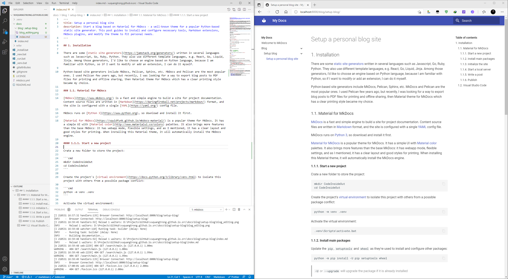

## 1. Installation

There are some [static site generators](https://jamstack.org/generators/) written in several languages such as Javascript, Go, Ruby, Python. They also use different template languages, e.g. React, Go, Liquid, Jinja. Among those generators, I'd like to choose an engine based on Python language, because I am familiar with Python, so if I want to modify or add an extension, I can do it myself.

Python-based site generators include MkDocs, Pelican, Sphinx, etc. MkDocs and Pelican are the most popular ones. I used Pelican few years ago, but recently, I was looking for a way to export blog posts to PDF files for printing and offline sharing, then Material theme for MkDocs which has a clear printing style became my choice.

### 1.1. Material for MkDocs

[MkDocs](https://www.mkdocs.org/) is a fast and simple engine to build a site for project documentation. Content source files are written in [Markdown](https://daringfireball.net/projects/markdown/) format, and the site is configured with a single [YAML](https://yaml.org/) config file.

MkDocs runs on [Python 3](https://www.python.org), so download and install it first.

[Material for MkDocs](https://squidfunk.github.io/mkdocs-material/) is a popular theme for MkDocs. It has a simple UI with [Material color](http://www.materialui.co/colors) palettes. It also brings more features than the base MkDocs: it has webapp mode, flexible settings, and as I mentioned, it has a clear layout and good styles for printing. When installing this Material theme, it will automatically install the MkDocs engine.

#### 1.1.1. Start a new project

Create a new folder to store the project:

```cmd
mkdir CodeInsideOut
cd CodeInsideOut
```

Create the project's [virtual environment](https://docs.python.org/3/library/venv.html) to isolate this project with others from a possible package conflict:

```cmd
python -m venv .venv
```

Activate the virtual environment:

```cmd
.venv\Scripts\activate.bat
```

#### 1.1.2. Install main packages

Update the `pip`, `setuptools` and `wheel` as they're used to install and configure other packages:

```cmd
python -m pip install -U pip setuptools wheel
```

> `-U` or `--upgrade` will upgrade the package if it is already installed

Then install the _Material for Mkdocs_ package:

```cmd
pip install -U mkdocs-material
```

#### 1.1.3. Initialize the site

Bring up the base of the site:

```cmd
mkdocs new .
```

This will create the following file structure:

```sh
.
├─ mkdocs.yml    # The configuration file
└─ docs/         # Other markdown pages
    ├─ index.md  # The documentation homepage
    └─ ...       # Other files
```

Change the theme to _material_ in the project configuration file `mkdocs.yml`:

```yaml
theme:
    name: material
```

#### 1.1.4. Start a local server

Run a local server with:

```cmd
mkdocs serve
```

and preview the site at <http://localhost:8000> to see the default homepage.

#### 1.1.5. Write a post

Each Markdown file inside the folder `docs` will be rendered to a page of the site. The index page is located at `docs\index.md`. There can be sub-folders inside the `docs` directory to contain a group of posts in separate main topics.

If a post is named other than `index.md`, the filename will be used as the directory path of the generated page. Here is how MkDocs generates URLs for Markdown posts:

-   folder `docs` becomes the root of the site [www.site.com/](#)
-   file `docs\blog\index.md` becomes a link [www.site.com/blog/](#)
-   file `docs\blog\a-post.md` becomes a link [www.site.com/blog/a-post/](#)

> Use hyphen `-` in folder name and file name to create good URLs.\
> Here are some tips to [keep URLs simple](https://developers.google.com/search/docs/advanced/guidelines/url-structure).

#### 1.1.6. Publish

To publish the site, build it first:

```cmd
mkdocs build
```

then copy all the content in the `site` folder to the website root folder.

### 1.2. Visual Studio Code

Download and install [Visual Studio Code](https://code.visualstudio.com/) - a lightweight but powerful source code editor. It well supports users to write code, documents, notes. This editor also have some extensions to turn it into a full-feature IDE for coding, such as [PlatformIO](https://platformio.org/).



Useful extensions for writing in Markdown format and editing HTML template:

-   [**Markdown All in One**](https://marketplace.visualstudio.com/items?itemName=yzhang.markdown-all-in-one): add keyboard shortcuts, auto completion, edit and format list and table
-   [**Markdown Paste**](https://marketplace.visualstudio.com/items?itemName=telesoho.vscode-markdown-paste-image): paste images, links from the clipboard
-   [**Draw.io Integration**](https://marketplace.visualstudio.com/items?itemName=hediet.vscode-drawio): edit diagrams and svg images
-   [**Jinja**](https://marketplace.visualstudio.com/items?itemName=wholroyd.jinja): highlight Jinja syntax in HTML templates
-   [**Sublime Text Keymap and Settings Importer**](https://marketplace.visualstudio.com/items?itemName=ms-vscode.sublime-keybindings): import keybindings and settings
-   [**Code Spell Checker**](https://marketplace.visualstudio.com/items?itemName=streetsidesoftware.code-spell-checker): catch common spelling errors
-   [**Prettier - Code formatter**](https://marketplace.visualstudio.com/items?itemName=esbenp.prettier-vscode): a formatter which supports a lot of languages

## 2. Configuration

Material for MkDocs is just a start point. It is needed to be customized a little to fit my personal tastes. Refer to the official homepage of for more and complete guides, as I just list here main points to tweak the theme.

### 2.1. Site information

Site information consists of the name, the URL, the title, a description and some keywords that are used to get brief information about the content of the site.

These information is configured in the config file `mkdocs.yml` as below:

```yaml
site_name: Code Inside Out
site_url: https://www.codeinsideout.com/ # must have the trailing slash
site_author: vqtrong
site_email: vuquangtrong@gmail.com
site_description: >-
    Interesting stuff in Embedded Systems and IoT Applications.
    From hardwares to cloud applications. Step by step.
site_keywords: embedded systems application programming
copyright: >-
    © 2021 Code Inside Out
```

The social links can be added in the `extra` section in the config file `mkdocs.yml`.
Refer to the guide of [setting up the footer](https://squidfunk.github.io/mkdocs-material/setup/setting-up-the-footer/). The icon field must point to a valid icon path referencing to a [bundled icon](markdown-syntax/index.md/#12-icons--emojis).

```yaml
extra:
    social:
        - icon: fontawesome/brands/github-alt
          link: https://github.com/vuquangtrong
          name: vuquangtrong
        - icon: fontawesome/brands/facebook-f
          link: https://facebook.com/trongvq
          name: trongvq
        - icon: fontawesome/brands/linkedin-in
          link: https://www.linkedin.com/in/vqtrong
          name: vqtrong
```

::: np

### 2.2. Color palette

[Changing color](https://squidfunk.github.io/mkdocs-material/setup/changing-the-colors/) is to select colors for 2 main groups:

-   the primary color which is used for the header, the sidebar, text links and several other components.
-   the accent color which is used to denote elements that can be interacted with, e.g. hovered links, buttons and scroll-bars.

Both of them can be changed in `mkdocs.yml` by choosing a valid color name. As this page is intent to be printed on paper, I choose the white color as the primary look and feel, and the deep orange color for interactive elements.

```yaml
theme:
    palette:
        primary: white
        accent: deep orange
```

### 2.3. Fonts

Serif fonts[^serif] are widely used for body text because they are considered to be more easier to read than Sans-Serif fonts in print.

[^serif]: https://en.wikipedia.org/wiki/Serif

For better reading, distinguishing the digit zero `0` from the Latin script letter Oh `o` or `O` is a way to avoid mistake, especially while reading technical notes. Fonts for source code do have slashed / dotted / open zero[^zero], but fonts for reading don't have those styles.

[^zero]: https://en.wikipedia.org/wiki/Slashed_zero

It's also needed to clearly distinguish the digit one `1` with lowercase i `i`, the uppercase i `I`, and the lowercase l `l`. Luckily, they usually do not stand close to each other.

To replace the [defaults fonts](https://squidfunk.github.io/mkdocs-material/setup/changing-the-fonts/), this site uses _Noto Serif_ for the body text, and _Roboto Mono_ for the code block.

```yaml
theme:
    font:
        text: Noto Serif
        code: Roboto Mono
```

Can you easily read below pairs of characters?

-   Body text: 0o 0O oO 1i 1I 1l 1L iI il iL Il IL lL
-   Code block: `0o 0O oO 1i 1I 1l 1L iI il iL Il IL lL`

### 2.4. Logo & Icon

I want to replace the [default icon](https://squidfunk.github.io/mkdocs-material/setup/changing-the-logo-and-icons) and logo with this `code` symbol :fontawesome-solid-code:.

```yaml
theme:
    icon:
        logo: fontawesome/solid/code
    favicon: favicon.png
```

To use the included icons in Material theme, refer to [Markdown syntax - Icons and Emojis](markdown-syntax/index.md).

### 2.5. Navigation

Here are some interesting features for the [navigation](https://squidfunk.github.io/mkdocs-material/setup/setting-up-navigation/) in Material theme:

#### 2.5.1. Instant loading

When instant loading is enabled, clicks on internal links will be intercepted and dispatched via [XHR](https://developer.mozilla.org/en-US/docs/Web/API/XMLHttpRequest) without fully reloading the page. The resulting page is parsed and injected and all event handlers and components are rebound automatically. This means that the site behaves like a Single Page Application, which is especially useful for large documentation sites that come with a massive search index, as the search index will now remain intact in-between document switches.

Material for MkDocs is the only MkDocs theme offering this feature.

!!! warning "Dynamic Javascript-enabled elements do not work after AJAX content is loaded"

    After an AJAX request is done, the old content is replaced with the new content, causing dynamic content and handlers are destroyed, such as items were selected by javascript query, Mermaid code blocks, disqus comments, registered event for clicking, etc.

    A solution is given in [Fix AJAX issue](fix-ajax-issue/index.md).

#### 2.5.2. Navigation tabs

When tabs are enabled, top-level sections (first-level directories in the `docs` folder) are rendered in a menu layer below the header.

#### 2.5.3. Back-to-top button

A back-to-top button can be shown when the user, after scrolling down, starts to scroll up again. It's rendered in the lower right corner of the viewport, and help to go to the top a the page quickly.

#### 2.5.4. Hide header bar

When auto hiding is enabled, the header is automatically hidden when the user scrolls past a certain threshold, leaving more space for content.

```yaml
theme:
    features:
        - navigation.instant
        - navigation.tabs
        - navigation.top
        - header.autohide
```

### 2.6. Table of Content

The [Table of Content extension](https://python-markdown.github.io/extensions/toc/) provides a quick navigation between sections in the post, it also places an anchor link at each header. This anchor can be used to link the header from other pages. The `toc_depth: 4` makes the list displays from `<h1>` to `<h4>`.

```yaml
markdown_extensions:
    - toc:
          permalink: ⚓︎
          slugify: !!python/name:pymdownx.slugs.uslugify
          toc_depth: 4
```

### 2.7. Site analytics

Material for MkDocs natively integrates with [Google Analytics](https://developers.google.com/analytics). Just need to create a new GA property in order to obtain a unique tracking id of the form `UA-XXXXXXXX-X`, add it to mkdocs.yml:

```yaml
google_analytics:
    - UA-XXXXXXXX-X
    - auto
```

### 2.8. Comments section

Material for MkDocs is natively integrated with [Disqus](https://disqus.com/), a comment system that provides a wide range of features like social integrations, user profiles, as well as spam and moderation tools.

After setting up the `site_url` in `mkdocs.yml`, Disqus is configured by adding the Disqus shortname:

```yaml
extra:
    disqus: "shortname"
```

This will insert a comment system on every page, except the [index page](/).
If the [Metadata extension](markdown-syntax/index.md#1-meta-data) is enabled, Disqus can be disabled per page by using an empty string:

```yaml
---
disqus: ""
---
```

### 2.9. Extra styles and scripts

Add stylesheets and javascript files to the `docs` directory as below structure:

```md hl_lines="4 5"
.
├─ docs/
│ ├─ assets/
│ | └─ extra.css
│ | └─ extra.js
| └─ blog/
└─ mkdocs.yml
```

Then, add the following line to `mkdocs.yml`:

```yaml
extra_css:
    - assets/extra.css
extra_javascript:
    - assets/extra.js
```

It's ready to add extra styles and scripts to the site at the moment, but it should be done later after adding new layouts and elements to the theme. At this time, I just need to add some small additional styles to make the theme look a bit harmonious with the selected theme color.

To do that, in the webpage, right-click on an element, then select **Inspect** menu to go to the **Developer Mode**, and check the tag and the class of the selected element.

The page content is usually wrapped inside the tag `#!html <article class="md-content__inner md-typeset"> </article>`, so select either the tag or a class of that tag to use as the container of extra styles. Here are some small requirements:

-   Logo and headers should be in orange to be highlighted, and active links can be in dark blue:

    ```css
    .md-logo,
    .md-typeset h1 {
        color: orangered;
    }
    .md-typeset h2,
    .md-typeset h3,
    .md-typeset h4,
    .md-tabs__link.md-tabs__link--active,
    .md-nav__link.md-nav__link--active {
        color: darkblue;
    }
    ```

-   Search input should have white background color:

    ```css
    .md-search__input {
        background-color: white !important;
    }
    ```

-   Non-highlighted code needs stand out a bit in dark red in white background:

    ```css
    .md-typeset code {
        color: darkred;
        background-color: rgba(0, 0, 0, 0.01);
    }
    ```

-   Normal paragraph should be fully justified:

    ```css
    .md-typeset p {
        text-align: justify;
    }
    ```

-   Emphasized text should be in dark magenta:

    ```css
    .md-typeset em {
        color: darkmagenta;
    }
    ```

-   Footer should look smaller by changing the background color:

    ```css
    .md-footer {
        color: unset;
        background-color: unset;
    }
    .md-footer-meta {
        background-color: black;
    }
    ```

For more stylings, please read more in [Customize theme](#5-customize-theme).

### 2.10. Override templates

MkDocs allows to override the them by just adding extra files that will replace the original ones when building the site. Create a new folder `overrides` in the project folder to save the overriding files, then enable them in the config file `mkdocs.yml`:

```yaml
theme:
    name: material
    custom_dir: overrides
```

#### 2.10.1. Override files

The structure in the `overrides` directory must mirror the directory structure of the original theme, as any file in the overrides directory will replace the file with the same name which is part of the original theme. Besides, further assets may also be put in the overrides directory.

```sh
.
├─ .icons/                             # Bundled icon sets
├─ assets/
│  ├─ images/                          # Images and icons
│  ├─ javascripts/                     # JavaScript
│  └─ stylesheets/                     # Stylesheets
├─ partials/
│  ├─ integrations/                    # Third-party integrations
│  │  ├─ analytics.html                # - Google Analytics
│  │  └─ disqus.html                   # - Disqus
│  ├─ languages/                       # Localized languages
│  ├─ footer.html                      # Footer bar
│  ├─ header.html                      # Header bar
│  ├─ language.html                    # Localized labels
│  ├─ logo.html                        # Logo in header and sidebar
│  ├─ nav.html                         # Main navigation
│  ├─ nav-item.html                    # Main navigation item
│  ├─ palette.html                     # Color palette
│  ├─ search.html                      # Search box
│  ├─ social.html                      # Social links
│  ├─ source.html                      # Repository information
│  ├─ source-date.html                 # Last updated date
│  ├─ source-link.html                 # Link to source file
│  ├─ tabs.html                        # Tabs navigation
│  ├─ tabs-item.html                   # Tabs navigation item
│  ├─ toc.html                         # Table of contents
│  └─ toc-item.html                    # Table of contents item
├─ 404.html                            # 404 error page
├─ base.html                           # Base template
└─ main.html                           # Default page
```

The template file `base.html`, which originally located in the folder `.venv\Lib\site-packages\material`, is the starting point of any site's page. All other pages should extend from it. The `main.html` template, which extends the `base.html`, is used to add a custom template.

To use other template, in the metadata of the Markdown file, set the attribute `template` with the name of template file. For example:

```md
---
title: Blog
template: blog.html
---
```

#### 2.10.2. Override blocks

Besides overriding partials, it's also possible to override (and extend) template blocks, which are defined inside the template files and wrap specific features. To override a block, create a new template `.html` file inside the `overrides` directory, and define a same block name with the one which will be overridden:

```jinja hl_lines="2"


    <title>New title</title>

```

To extend a block, use the `#!jinja {{ super() }}` command:

```jinja hl_lines="3"


    {{ super() }}
    Appended content

```

==To replace a block, don't use the `#!jinja {{ super() }}` command.==

```jinja

    New content

```

The list of blocks:

```sh
analytics   # Wraps the Google Analytics integration
announce    # Wraps the announcement bar
config      # Wraps the JavaScript application config
content     # Wraps the main content
disqus      # Wraps the Disqus integration
extrahead   # Empty block to add custom meta tags
fonts       # Wraps the font definitions
footer      # Wraps the footer with navigation and copyright
header      # Wraps the fixed header bar
hero        # Wraps the hero teaser (if available)
htmltitle   # Wraps the <title> tag
libs        # Wraps the JavaScript libraries (header)
outdated    # Wraps the version warning
scripts     # Wraps the JavaScript application (footer)
source      # Wraps the linked source files
site_meta   # Wraps the meta tags in the document head
site_nav    # Wraps the site navigation and table of contents
styles      # Wraps the stylesheets (also extra sources)
tabs        # Wraps the tabs navigation (if available)
```

#### 2.10.3. The index page

The [index page](../../index.md) of the website is located at `docs\index.md`. Material theme created a default one then it has to be modified. I'd like to write a brief information about me and why this blog is created:

```md
Welcome to

# Code Inside Out

Interesting stuff in Embedded Systems and IoT Applications.
From hardwares to cloud applications. Step by step.
(ﾉ ◕ ヮ ◕)ﾉ\*:・ﾟ ✧
```

#### 2.10.4. The 404 page

Whenever a page is not found in a website, the error `404` is return to the requested users. I need to create this special page to display a short message and guide user to search in this blog.

The [404 page](/404) should be created in the `overrides` folder as it will replace the default 404 page of Material theme. Its layout is based on the `base.html`, and the content is a message displayed in the center of the page. The `disqus` comment section is removed. The sidebar should not be visible to display message clearly.

```jinja



<style>
    .md-sidebar {
        display: none;
    }
</style>
<div style="text-align: center;">
    <h1>
        Oops! Something went wrong!
    </h1>
    <h3>
        Please go back to the
        <a href="{{ config.site_url }}">
            {{ config.site_name }}
        </a>
        homepage,<br>
        or press <kbd>S</kbd> to search on this site.
    </h3>
</div>




```

## 3. Markdown extensions

Markdown comes with a simple syntax to create headers, links, images, and paragraphs with formatted text, lists. However, that's not enough. Some Markdown extensions bring more syntaxes to create complex elements or new layouts that help writing documents easier, faster, and look professional.

Read more in [Markdown syntax](markdown-syntax/index.md).

## 4. MkDocs plugins

New features can be added to MkDocs engine by installing plugins. These packages can modify the navigation behavior, or render new content types, or export the site to PDF documents. Plugins also can be modified easily as they are written in Python.

Read more in [MkDocs plugins](mkdocs-plugins/index.md).

## 5. Customize theme

A personal website should look different to others to make it unique and standout. I prefer a simple look which goes straight to the content, and pages should be clear to be printed on papers. Therefore, I modified styles for some elements, also bring must-have elements of a blog like tag cloud, tag page, list of posts.

Read more in [Customize theme](customize-theme/index.md).

## 6. Print to PDF

For printing or offline reading, the document should be exported to PDF format. A manual method is to print each post by the user browser. There is a plugin to automatically export all site's posts to PDF during the build time, but it needs some configuration to work as I expected. Generated PDF files can be download by clicking on the download button at the beginning of each page.

Read more in [Print to PDF](print-to-pdf/index.md).
