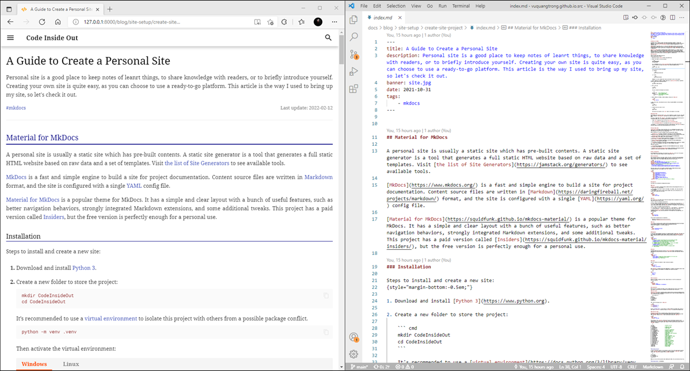

## Material for MkDocs

A personal site is usually a static site which has pre-built contents. A static site generator is a tool that generates a full static HTML website based on raw data and a set of templates. Visit [the list of Site Generators](https://jamstack.org/generators/) to see available tools.

[MkDocs](https://www.mkdocs.org/) is a fast and simple engine to build a site for project documentation. Content source files are written in [Markdown](https://daringfireball.net/projects/markdown/) format, and the site is configured with a single [YAML](https://yaml.org/) config file.

[Material for MkDocs](https://squidfunk.github.io/mkdocs-material/) is a popular theme for MkDocs. It has a simple and clear layout with a bunch of useful features, such as better navigation behaviors, strongly integrated Markdown extensions, and some additional tweaks. This project has a paid version called [Insiders](https://squidfunk.github.io/mkdocs-material/insiders/), but the free version is perfectly enough for a personal use.


### Installation

Steps to install and create a new site:
{style="margin-bottom:-0.5em;"}

1. Download and install [Python 3](https://www.python.org).

2. Create a new folder to store the project:

    ``` cmd
    mkdir CodeInsideOut
    cd CodeInsideOut
    ```

    It's recommended to use a [virtual environment](https://docs.python.org/3/library/venv.html) to isolate this project with others from a possible package conflict.
    
    ``` cmd
    python -m venv .venv
    ```

    Then activate the virtual environment:

    === "Windows"

        ``` cmd
        .venv\Scripts\activate.bat
        ```
    
    === "Linux"
    
        ``` cmd
        .venv/Scripts/activate
        ```

    Remember to run this command every time you come back to work in this project.
    
3. Install _Material for MkDocs_ package. Read more at [getting started](https://squidfunk.github.io/mkdocs-material/getting-started/):

    ``` cmd
    pip install mkdocs-material
    ```

4. Start a new site:

    ``` cmd
    mkdocs new .
    ```

    This will create the following file structure:

    ``` sh
    .
    ├─ mkdocs.yml    # The configuration file
    └─ docs/         # Other markdown pages
        ├─ index.md  # The documentation homepage
        └─ ...       # Other files
    ```

5. Enable _Material for MkDocs_ theme by adding a config into `mkdocs.yml`:

    ``` yaml
    theme:
        name: material
    ```

6. Run a local server, and preview the site at <http://localhost:8000> to see the default homepage:

    ``` cmd
    mkdocs serve
    ```

7. To publish the site, build it first:

    ``` cmd
    mkdocs build
    ```

    Then copy all the content in the `site` folder to the website's root folder.


### Working folder

Each Markdown file inside the folder `docs` will be rendered as a page of the site. The index page is located at `docs\index.md`. Sub-folders are used as the path to a group of related posts.

If a post is named other than `index.md`, the filename will be used as the directory path of the generated page. Here is how MkDocs generates URLs for Markdown posts:

-   folder `docs` becomes the root of the site [www.site.com/](#)

-   file `docs\blog\post.md` becomes the link [www.site.com/blog/post/](#)

-   file `docs\blog\post\index.md` also becomes the link [www.site.com/blog/post/](#)
 
> Use hyphen (`-`) in folder name and file name to create good URLs. Some tips [here](https://developers.google.com/search/docs/advanced/guidelines/url-structure).


## Visual Studio Code

[Visual Studio Code](https://code.visualstudio.com/) is a lightweight but powerful source code editor. It well supports users to write code, documents, notes. This editor also have some extensions to turn it into a full-feature IDE.

Useful extensions for writing in Markdown format and editing HTML template:

-   [Markdown All in One](https://marketplace.visualstudio.com/items?itemName=yzhang.markdown-all-in-one): add keyboard shortcuts, auto-completion, edit and format list and table.

-   [Markdown Paste](https://marketplace.visualstudio.com/items?itemName=mushan.vscode-paste-image): paste images, links from the clipboard.

-   [Prettier — Code formatter](https://marketplace.visualstudio.com/items?itemName=esbenp.prettier-vscode): a formatter which supports a lot of languages.

-   [Draw.io Integration](https://marketplace.visualstudio.com/items?itemName=hediet.vscode-drawio): edit diagrams and SVG images.

-   [LTeX](https://marketplace.visualstudio.com/items?itemName=valentjn.vscode-ltex): Grammar/spell checker using LanguageTool with support for LaTeX, Markdown, and others.

Additional extensions:

-   [Jinja](https://marketplace.visualstudio.com/items?itemName=wholroyd.jinja): highlight Jinja syntax in HTML templates.

-   [Sublime Text Key map and Settings Importer](https://marketplace.visualstudio.com/items?itemName=ms-vscode.sublime-keybindings): import keybindings and settings.




## Basic Configuration

All configurations are declared in the config file `mkdocs.yml` at the root of the project folder. Here are some main settings to quickly customize your site:


### Site Information

Site information consists of the name, the URL, the title, a description and some keywords that are used to get brief information about the content of the site. _The copyright word should include a link to the original theme when you use the free version._

``` yaml
site_name: Code Inside Out
site_url: https://www.codeinsideout.com/ # must have the trailing slash
site_author: Vũ Quang Trọng (vuquangtrong@gmail.com)
site_description: Guides, notes and useful stuff for learning embedded systems.
copyright: > # should remain a link to the original theme
  &copy; 2021 Code Inside Out<br>
  <a href="https://github.com/vuquangtrong/mkdocs-material-blog">Blog Theme</a> /
  <a href="https://squidfunk.github.io/mkdocs-material/">Material for MkDocs</a>
```

The social links in the [footer](https://squidfunk.github.io/mkdocs-material/setup/setting-up-the-footer) can be added in the `extra` section.

``` yaml
extra:
  social:
    - icon: fontawesome/brands/github-alt
      link: https://github.com/vuquangtrong
      name: vuquangtrong
    - icon: fontawesome/brands/facebook-f
      link: https://facebook.com/trongvq
      name: trongvq
    - icon: fontawesome/brands/linkedin-in
      link: https://www.linkedin.com/in/vqtrong
      name: vqtrong
  generator: false # hide the line "Made with Material for MkDocs"
```


### Appearance

The theme can be customized by changing below options:


#### Colors

[Changing color](https://squidfunk.github.io/mkdocs-material/setup/changing-the-colors/) is to select colors for 2 main groups:

-   The _primary_ color which is used for the header, the sidebar, text links and several other components.
-   The _accent_ color which is used to denote elements that can be interacted with, e.g. hovered links, buttons and scroll-bars.

``` yaml
theme:
  palette:
    primary: white
    accent: deep orange
```


#### Fonts

Serif fonts[^serif] are widely used for body text because they are considered to be easier to read than Sans-Serif fonts in print.

[^serif]: <https://en.wikipedia.org/wiki/Serif>

For better reading, distinguishing the digit zero `0` from the Latin script letter Oh `o` or `O` is a way to avoid mistake, especially while reading technical notes. Fonts for source code do have slashed/ dotted/ open zero[^zero], but fonts for reading don't have those styles.

[^zero]: <https://en.wikipedia.org/wiki/Slashed_zero>

It's also needed to clearly distinguish the digit one `1` with lowercase `i`, the uppercase `I`, and the lowercase `l`. Luckily, they usually do not stand close to each other.

To replace the [defaults fonts](https://squidfunk.github.io/mkdocs-material/setup/changing-the-fonts/), this site uses _Noto Serif_ for the body text, and _Roboto Mono_ for the code block.

``` yaml
theme:
  font:
    text: Noto Serif
    code: Roboto Mono
```

Can you easily read below pairs of characters?

-   Body text: 0o 0O oO 1i 1I 1l 1L iI il iL Il IL lL
-   Code block: `0o 0O oO 1i 1I 1l 1L iI il iL Il IL lL`


#### Icons

[Icons](https://squidfunk.github.io/mkdocs-material/setup/changing-the-logo-and-icons/#logo) can be selected in built-in icon packs, such as :fontawesome-solid-code:{style="color:orangered"}. It can be an image also.

``` yaml
theme:
  icon:
    logo: fontawesome/solid/code
  favicon: favicon.png
```


### Navigation

A clear and concise navigation structure is an important aspect of good site. The layout will be 3 columns: Site Navigation, Main Content, Table of Content. Some [navigation features](https://squidfunk.github.io/mkdocs-material/setup/setting-up-navigation/) are applied as below:

``` yaml
theme:
  name: material
  features:
    # - navigation.instant # some features may not work properly with XHR
    - navigation.tracking # the URL changes with the active anchor
    - navigation.tabs # first top-level sections are shown as tabs
    # - navigation.tabs.sticky # tabs always show
    # - navigation.sections # sections are rendered as groups in the sidebar
    # - navigation.expand # all sections are expanded
    - navigation.indexes # link an index.md page to a section
    - navigation.top # show back-to-top button
    # - toc.integrate # show table of contents to navigation panel
    # - header.autohide
```


### Search

The MkDocs-based sites come with a built-in [search engine](https://squidfunk.github.io/mkdocs-material/setup/setting-up-site-search), which also provides some additional features as below:

``` yaml
theme:
  name: material
  features:
    - search.suggest # display the likeliest completion for the last word
    - search.highlight # highlight all occurrences
    - search.share # show a share button
```


### Content

Some extra features are enabled to render interactive elements. 

``` yaml
theme:
  name: material
  features:
    - content.code.annotate
```

When [Metadata](../markdown-syntax/#metadata) is enabled, the navigation and/or table of contents sidebars can be hidden for a document with custom front matter.

``` yaml
---
hide:
  - navigation
  - toc
  - feedback
---
```


### Site analytics

Material for MkDocs integrates with both, Google Analytics 4 and the now phasing out Universal Analytics.

``` yaml
extra:
  analytics:
    provider: google
    property: G-XXXXXXXXXX or UA-XXXXXXXX-X
```


### Customization

Below are ways to customize the theme in terms of adding some extra lines of code. However, this method is quite easy even for beginners who have known some of CSS and JS.

#### Extra assets

[Additional assets](https://squidfunk.github.io/mkdocs-material/customization/#adding-assets) can be used to add user's stylesheets and JavaScript files. Those file should be added to the `docs` directory as below structure:

``` md hl_lines="4 5"
.
├─ docs/
│ ├─ assets/
│ | └─ extra.css
│ | └─ extra.js
| └─ blog/
└─ mkdocs.yml
```

Then, add the following line to `mkdocs.yml`:

``` yaml
extra_css:
    - assets/extra.css
extra_javascript:
    - assets/extra.js
```

Use the __Developer mode__ in your browser to inspect elements and changes their styles as your taste in `extra.css`. Add extra scripts to `extra.js` to interact with elements also.

#### Extend the theme

[Extending the theme](https://squidfunk.github.io/mkdocs-material/customization/#extending-the-theme) is a way to alter the HTML structure and layout. Create a new folder name `overrides` beside the `docs` folder and add below config into `mkdocs.yml`:

``` yaml
theme:
  name: material
  custom_dir: overrides
```

The structure in the `overrides` directory must mirror the directory structure of the original theme, as any file in the `overrides` directory will replace the file with the same name which is part of the original theme. Besides, further assets may also be put in the `overrides` directory:

``` sh
.
├─ .icons/                             # Bundled icon sets
├─ assets/
│  ├─ images/                          # Images and icons
│  ├─ javascripts/                     # JavaScript files
│  └─ stylesheets/                     # Style sheets
├─ partials/
│  ├─ integrations/                    # Third-party integrations
│  │  ├─ analytics/                    # Analytics integrations
│  │  └─ analytics.html                # Analytics setup
│  ├─ languages/                       # Translation languages
│  ├─ content.html                     # Page content
│  ├─ copyright.html                   # Copyright and theme information
│  ├─ footer.html                      # Footer bar
│  ├─ header.html                      # Header bar
│  ├─ language.html                    # Translation setup
│  ├─ logo.html                        # Logo in header and sidebar
│  ├─ nav.html                         # Main navigation
│  ├─ nav-item.html                    # Main navigation item
│  ├─ palette.html                     # Color palette
│  ├─ search.html                      # Search interface
│  ├─ social.html                      # Social links
│  ├─ source.html                      # Repository information
│  ├─ source-file.html                 # Source file information
│  ├─ tabs.html                        # Tabs navigation
│  ├─ tabs-item.html                   # Tabs navigation item
│  ├─ toc.html                         # Table of contents
│  └─ toc-item.html                    # Table of contents item
├─ 404.html                            # 404 error page
├─ base.html                           # Base template
└─ main.html                           # Default page
```


__Overriding partials__

In order to override a partial, we can replace it with a file of the same name and location in the `overrides` directory. For example, to replace the original `footer.html` partial, create a new `footer.html` partial in the `overrides` directory:

``` sh
.
├─ overrides/
│  └─ partials/
│     └─ footer.html
└─ mkdocs.yml
```

MkDocs will now use the new partial when rendering the theme. This can be done with any file.

\
__Overriding blocks__ _(recommended)_

Besides overriding partials, it's also possible to override (and extend) template blocks, which are defined inside the templates and wrap specific features. In order to set up block overrides, create a `main.html` file inside the `overrides` directory:

``` sh
.
├─ overrides/
│  └─ main.html
└─ mkdocs.yml
```

Then, e.g. to override the site title, add the following lines to main.html:

``` jinja



    <title>Lorem ipsum dolor sit amet</title>

```

The following template blocks are provided by the theme:

``` sh
analytics	# Wraps the Google Analytics integration
announce	# Wraps the announcement bar
config	    # Wraps the JavaScript application config
content	    # Wraps the main content
disqus	    # Wraps the Disqus integration
extrahead	# Empty block to add custom meta tags
fonts	    # Wraps the font definitions
footer	    # Wraps the footer with navigation and copyright
header	    # Wraps the fixed header bar
hero	    # Wraps the hero teaser (if available)
htmltitle	# Wraps the <title> tag
libs	    # Wraps the JavaScript libraries (header)
outdated	# Wraps the version warning
scripts	    # Wraps the JavaScript application (footer)
site_meta	# Wraps the meta tags in the document head
site_nav	# Wraps the site navigation and table of contents
styles	    # Wraps the style sheets (also extra sources)
tabs	    # Wraps the tabs navigation (if available)
```


### Comment system

[Disqus](https://disqus.com/) can be easily integrated into theme by overriding the file `post-content.html`, and adding `disqus` section. See full guide [here](https://squidfunk.github.io/mkdocs-material/setup/adding-a-comment-system/#disqus-integration).

``` yaml title="mkdocs.yml"
extra:
  disqus: "vuquangtrong-github-io"
```

``` html title="overrides\partials\post-content.html"
--8<-- "overrides\partials\post-content.html"
```

``` html title="overrides\partials\disqus.html"
--8<-- "overrides\partials\disqus.html"
```
