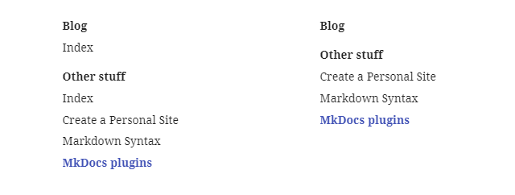
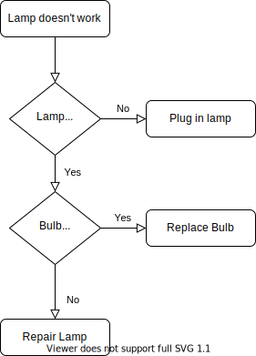
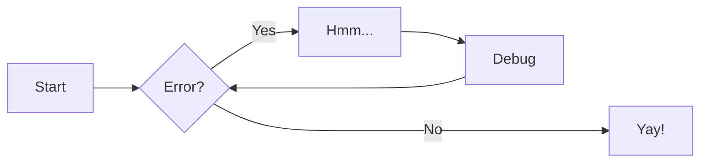

Places to get MkDocs Plugins: [Official List](https://github.com/mkdocs/mkdocs/wiki/MkDocs-Plugins), [Wheelodex](https://www.wheelodex.org/entry-points/mkdocs.plugins/), and [GitHub](https://github.com/search?l=Python&o=desc&q=%22from+mkdocs.plugins+import%22&s=indexed&type=Code).


## Awesome Pages

[MkDocs Awesome Pages plugin](https://github.com/lukasgeiter/mkdocs-awesome-pages-plugin) simplifies configuring page titles and their entries order.

Install the plugin:

``` cmd
pip install -U mkdocs-awesome-pages-plugin
```

Enable it in the config file `mkdocs.yml`:

``` yaml
plugins:
    - search # built-in search must be always activated
    - awesome-pages
```

Create a YAML file named `.pages` in a directory and use a local `nav` attribute to customize the navigation in each folder with some more extra configurations:

1.  A 3-dots `...` entry is used to specify where all remaining items should be inserted. It can filter the remaining items using glob patterns or regular expressions. For example:

    !!! attention " "

        The pattern is checked against the _basename_ of remaining items - not their whole path, so it can be used to filter files in sub-folders.

2.  Hide directory by setting the `hide` attribute to `true`.

3.  Optionally set the directory title using the `title` attribute.
    Optionally specify a title for the navigation entry before its document path. For example:

4.  Collapse single nested pages by setting `collapse_single_pages` attribute to `true`.

_Example:_

``` yaml title=".pages"
title: New section
nav:
    - ... | introduction-*.md
    - ...
    - summary.md
    - First page: page1.md
    - Link Title: https://example.com
hide: false
collapse_single_pages: false
```


## Section index

!!! attention " "
    
    This plugin is no longer used in this site! The feature `navigation.indexes` comes with Material theme already does the work of this plugin.

In MkDocs, each directory will become a section, and by default, section only contains its children pages. There is no page associated to a section. [MkDocs Section Index](https://pypi.org/project/mkdocs-section-index/) is a plugin that attaches the first child page, usually an index page, to the section link.

Install the plugin:

``` cmd
pip install -U mkdocs-section-index
```

Enable it in the config file `mkdocs.yml`:

``` yaml
plugins:
    - search # built-in search must be always activated
    - awesome-pages
    - section-index # must be after awesome-pages # (1)
```

1. Note that the feature `navigation.indexes` comes with Material theme already to the work of this plugin.

The merged section page shows the section’s title from the _directory name_, not the attached page’s title.




## Revision date

To keep tracking the last modified date of a post, [git-revision-date](https://github.com/zhaoterryy/mkdocs-git-revision-date-plugin) plugin can be used. A better alternative plugin is [git-revision-date-localized](https://pypi.org/project/mkdocs-git-revision-date-localized-plugin/) which provides more types of date format (e.g. in time-ago format), and the creation date.

Install the plugin:

``` bat
pip install -U mkdocs-git-revision-date-localized-plugin
```

Enable it in the config file:

``` yaml
plugins:
    - search # built-in search must be always activated
    - git-revision-date-localized:
          enable_creation_date: true
          type: iso_date
```

This plugin creates new field in the post's meta-data which content the creation and update date. This information is used to sort the posts by revision date to get recently updated items, as shown in the [Recent blog posts](../add-new-features/#the-recent-blog-posts) page.


## Print to PDF

!!! attention " "

    Enabling this plugin causes very long build time when you have lot of posts!

To export the posts on this blog, there are some plugins which can do it. However, most of them depend on [Weasy Print](http://weasyprint.org/) which in turn depends on many other packages. There is one plugin that prints in an easy and simple way: use browser to print page by sending print command (like press `Ctrl + S`).

More detail of installation and configuration the [MkDocs PDF with JS](https://github.com/vuquangtrong/mkdocs-pdf-with-js-plugin) plugin for printing to PDF can be read in [Print to PDF](../print-to-pdf/).


## Macros

!!! attention " "
    
    This plugin is no longer used in this site!

[MkDocs Macros](https://mkdocs-macros-plugin.readthedocs.io/en/latest/) is a plugin/ framework that makes it easy to produce richer and more beautiful pages. It can do two things:

1. Transform the markdown pages into a [Jinja2 templates](https://jinja.palletsprojects.com) that can use variables, macros and filters.

2. Replace MkDocs plugins for a wide range of tasks: e.g. manipulating the navigation, adding files after the HTML pages have already been generated etc.

Install the plugin:

``` bat
pip install -U mkdocs-macros-plugin
```

Enable it in the config file:

``` yaml
plugins:
    - search # built-in search must be always activated
    - macros
```

!!! bug "Incomplete data in macro"
    
    The macro `#!jinja {{navigation.pages}}` contains a list of all pages, but the data of each page maybe not complete, such as _title_ or _meta-data_.

    This issue happens when rendering a the content of the first page, but it needs to know the content of the second page which has not been parsed already as it is waiting for the first page getting done.


## DrawIO Exporter

!!! attention " "
    
    This plugin is no longer used in this site!

[DrawIO Exporter](https://github.com/LukeCarrier/mkdocs-drawio-exporter) is a great plugin that exports the `.drawio` diagrams to images at build time and insert them to the document. This plugin can replace the [Mermaid](https://github.com/fralau/mkdocs-mermaid2-plugin) plugin, and it is faster thanks to no JavaScript needed at runtime. It also helps to enable instant navigation mode of the Material theme.

Install the plugin:

``` bat
pip install -U mkdocs-drawio-exporter
```

Enable it in the config file:

``` yaml
plugins:
    - search # built-in search must be always activated
    - drawio-exporter
```

To create end edit `.drawio` diagram, download and install the [diagrams.net](https://www.diagrams.net) application.

To import a diagram, just use the syntax for inserting an image:

``` md

```

The plugin will generate an SVG image to a cache folder (default in `docs\drawio-exporter`), and then modify the image's source to point to the generated image.

If the diagram is a multipage document, append the index of the page as an anchor in the image's URL to select the target page:

``` md

```



!!! info "Alternative method"

    Using [Draw.io Integration](../create-site-project/#visual-studio-code) extension in Visual Studio Code, I can save a DrawIO diagram as a `.drawio.svg` file, then use that file directly in the page as an usual image. However this method will not support multiple pages in the drawing:

    ``` md
       // work
     // does not work
    ```


## Mermaid

!!! attention " "
    
    This plugin is no longer used in this site!

[MkDocs Mermaid2](https://github.com/fralau/mkdocs-mermaid2-plugin) is a plugin to render textual graph description into [Mermaid](https://mermaid-js.github.io/mermaid) graphs (flow charts, sequence diagrams, pie charts, etc.).

Install the plugin:

``` bat
pip install -U mkdocs-mermaid2-plugin
```

Enable it in the config file:

``` yaml
plugins:
    - search # built-in search must be always activated
    - mermaid2
```

And configure the code block parser for mermaid2 blocks:

``` yaml
markdown_extensions:
    - pymdownx.superfences:
          custom_fences:
              - name: mermaid
                class: mermaid
                format: !!python/name:mermaid2.fence_mermaid
```

Example:

```` md

````

will render as:


