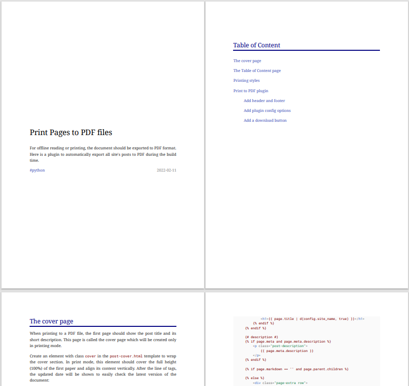

## The cover page

When printing to a PDF file, the first page should show the post title and its short description. This page is called the cover page which will be created only in printing mode.

Create an element with class `cover` in the `post-cover.html` template to wrap the cover section. In print mode, this element should cover the full height (100%) of the first paper and align its content vertically. After the line of tags, the updated date will be shown to easily check the latest version of the document:

``` html title="overrides\partials\post-cover.html"
--8<-- "overrides\partials\post-cover.html"
```


## The Table of Content page

When displaying on a screen, the Table of Content is displayed in the right sidebar. In printed pages, there should be a page to display the table of content too. This page is also only visible in printing.

The base Material for MkDocs theme has a partial block for Table of Content section, so I just need to declare it in `post-toc.html` and include it in the `main.html` template, between the cover page and the main content.

``` html title="overrides\partials\post-toc.html"
--8<-- "overrides\partials\post-toc.html"
```

There are some styles applied for this section:

-   Hide the default label and add a new `<h2>` header
-   Remove list-style to make a clear list
-   When printing, remove color effect on link items





## Printing styles

There are some more additional styles need to be applied on the page when printing. I preview the printed version using __Save to PDF__ option in the Chrome browser.

Set the paper size and printing margins:

``` css
@page {
    size: a4 portrait;
    margin: 25mm 15mm 25mm 20mm;
}
```

Some elements only show in printing version, add media query type to display them:

``` css
.md-typeset .print-only {
    display: none;
}
@media print {
    .md-typeset .print-only {
        display: block;
    }
    .md-typeset .screen-only {
        display: none;
    }
}
```

Tabs labels should be marked in printing as they are selected:

``` css
.md-typeset .tabbed-set > label {
    border-color: var(--md-accent-fg-color);
    color: var(--md-accent-fg-color);
}
```

The Disqus section also needs to be hidden in printing:

``` css
@media print {
    .md-typeset #__comments,
    .md-typeset #disqus_recommendations,
    .md-typeset #disqus_thread {
        display: none;
    }
}
```

Image and its caption should be displayed in the same page:

``` css
@media print {
    .md-typeset figure {
        page-break-inside: avoid;
    }
}
```

Admonition can be printed on multiple pages:

``` css
@media print {
    .md-typeset .admonition,
    .md-typeset details {
        page-break-inside: auto;
    }
}
```


## Print to PDF plugin

!!! warning "This feature is disabled by default !!!"

    The plugin depends on Chrome and Chrome Driver, and it also consumes quite long time to finish rederning. It is recommended to manually print pages that you need.

The [MkDocs PDF with JS Plugin][pdfjs][^o] exports documentation in PDF format with rendered JavaScript content. This is very useful if documents have mermaid diagrams. A download button will be added to the top of the page, and it is hidden in the PDF files.

[pdfjs]: https://github.com/vuquangtrong/mkdocs-pdf-with-js-plugin

[^o]: originally developed by [smaxtec](https://github.com/smaxtec/mkdocs-pdf-with-js-plugin)

For executing the JavaScript code, ChromeDriver is used, so it is necessary to:

1. Install [Chrome](https://www.google.com/chrome/), find the Chrome version in _About_ section.
2. Download [ChromeDriver](https://chromedriver.chromium.org/downloads), note to choose correct version of driver based on your installed Chrome version.
3. Add the ChromeDriver to OS user's `PATH` environment.

\
After that, install the plugin:

``` bat
pip install -U git+https://github.com/vuquangtrong/mkdocs-pdf-with-js-plugin.git
```

!!! warning " "

    Install the original plugin with `:::bat pip install mkdocs-pdf-with-js-plugin` if don't need a customized version. The following features are not implemented in the original version.

Enable the plugin:

``` yaml
plugins:
    - search # built-in search must be always activated
    - pdf-with-js
```

While building `mkdocs build` or serving `mkdocs serve` the documentation, the PDF files will be generated. They are stored in the `site\pdfs` folder.

### Add header and footer

The command sent to ChromeDriver to print a page is `Page.printToPDF`, read more at [Chrome DevTools Protocol — `printToPDF`](https://chromedevtools.github.io/devtools-protocol/tot/Page/#method-printToPDF).

This command needs some parameters to control the printing, which include:

_landscape_ : boolean
:   
    Paper orientation. Defaults to false.

_displayHeaderFooter_ : boolean
:   
    Display header and footer. Defaults to false.

_headerTemplate_: string
:   
    HTML template for the print header. Should be valid HTML markup with following classes used to inject printing values into them:

    - _date_: formatted print date
    - _title_: document title
    - _url_: document location
    - _pageNumber_: current page number
    - _totalPages_: total pages in the document

    For example, `#!html <span class=title></span>` would generate a span containing the _title_.

_footerTemplate_ : string
:   
    HTML template for the print footer. Should use the same format as the _headerTemplate_.

Those parameters are initialized in the `__init__` function:

``` python
def __init__(self):
    self.displayHeaderFooter = True
    self.headerTemplate = \
        '<div style="font-size:8px; margin:auto;">' \
        '<span class=title></span>' \
        '</div>'
    self.footerTemplate= \
        '<div style="font-size:8px; margin:auto;">' \
        'Page <span class="pageNumber"></span> of ' \
        '<span class="totalPages"></span>' \
        '</div>'
```

and they are used to creating print options in a dictionary variable:

``` python
def _get_print_options(self):
    return {
        'landscape': False,
        'displayHeaderFooter': self.displayHeaderFooter,
        'footerTemplate': self.footerTemplate,
        'headerTemplate': self.headerTemplate,
        'printBackground': True,
        'preferCSSPageSize': True,
    }
```

Finally, the print options are used in the print command:

``` python
def print_to_pdf(self, driver, page):
    driver.get(page["url"])
    result = self._send_devtools_command(
        driver, "Page.printToPDF",
        self._get_print_options()
    )
    self._write_file(result['data'], page["pdf_file"])
```

### Add plugin config options

To allow user to change the print options in the project config file `mkdocs.yml`, add the config fields into the `plugin.py` file.

``` python
class PdfWithJS(BasePlugin):
    config_scheme = (
        ('enable', config_options.Type(bool, default=True)),
        ('display_header_footer', config_options.Type(bool, default=False)),
        ('header_template', config_options.Type(str, default='')),
        ('footer_template', config_options.Type(str, default='')),
    )
```

When the MkDocs engine calls to `on_config()` function in this plugin, save the user's configs as below:

``` python
def on_config(self, config, **kwargs):
    self.enabled = self.config['enable']
    self.printer.set_config (
        self.config['display_header_footer'],
        self.config['header_template'],
        self.config['footer_template']
        )
    return config
```

By doing this, users can add their parameters to the `pdf-with-js` entry under the `plugins` field in the config file `mkdocs.yml`:

``` yaml
plugins:
    - search # built-in search must be always activated
    - pdf-with-js:
        enable: false # should enable only when need PDF files
        add_download_button: false
        display_header_footer: true
        header_template: >-
            <div style="font-size:8px; margin:auto; color:lightgray;">
                <span class="title"></span>
            </div>
        footer_template: >-
            <div style="font-size:8px; margin:auto; color:lightgray;">
                Page <span class="pageNumber"></span> of 
                <span class="totalPages"></span>
            </div>
```

### Add a download button

Create an element to contain the download button at the beginning of the document content in the `base.html` template. This element should be hidden in printing mode.

The plugin will find the `#!html <div class="btn-actions">` element to insert a button. If there is no such existing element, the plugin will create a new element and insert to the page content.

``` python
def _add_link(self, soup, page_paths):

    icon = BeautifulSoup(''
        '<span class="twemoji">'
            '<svg viewBox="0 0 24 24" xmlns="http://www.w3.org/2000/svg">'
                '<path d="M5 20h14v-2H5m14-9h-4V3H9v6H5l7 7 7-7z"></path>'
            '</svg>'
        '</span>',
        'html.parser')
    text = "PDF"

    btn = soup.new_tag("a", href=page_paths["relpath"])
    btn.append(icon)
    btn.append(text)
    btn['class'] = 'md-button'

    bar = soup.find("div", {"class" : "btn-actions"})
    if bar:
        bar.p.insert(0, btn)
    else:
        toc = soup.find("div", {"class" : "toc"})
        if toc:
            div = BeautifulSoup(''
                '<div class="btn-actions screen-only">'
                    '<p></p>'
                '</div>',
                'html.parser')
            div.p.insert(0, btn)
            toc.insert_after(div)

    return soup
```

That's it. All blog posts now have a download button for users to get the PDF version.
